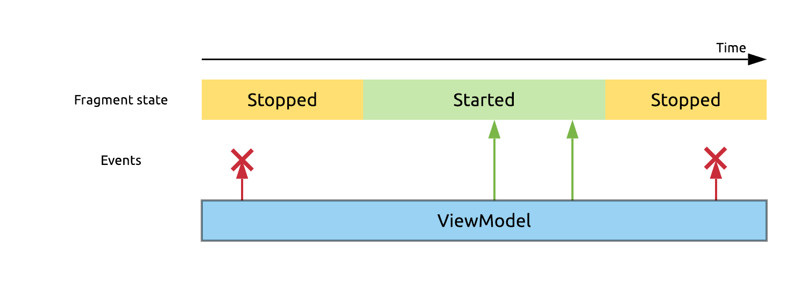
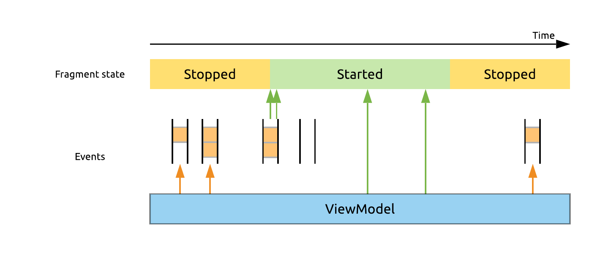
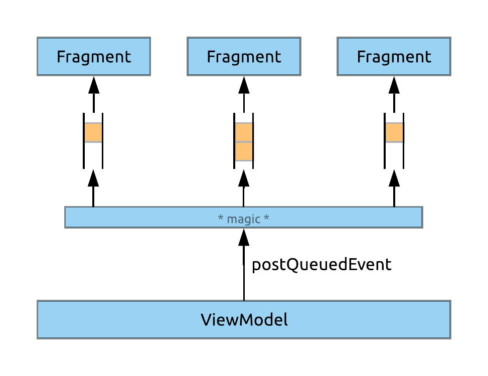

# 0.2.0 - The Breaking Changes Release

## Preface

This release contains many structural changes, and some new features. **However, it contains no critical bugfixes.** This means that if you don't want to suffer the cost of updating to this version right now, the previous version should keep working for you just fine.

If you keep using the old version and do find critical issues in it, report the issue, and a bugfix release using the old structure and package names will be provided for you, if necessary.

## Update steps

Updating your project is going to be just a little bit more effort than usual (should still be about 2 minutes using Studio, really).

1. Update your Gradle dependencies:

    ```groovy
    def rainbow_cake_version = '0.2.0'
    implementation "co.zsmb:rainbow-cake:$rainbow_cake_version"
    implementation "co.zsmb:rainbow-cake-navigation:$rainbow_cake_version"
    implementation "co.zsmb:rainbow-cake-timber:$rainbow_cake_version"
    ```

2. Perform the following search and replace actions in your project - <kbd>Ctrl + Shift + R</kbd>:

    | Original                | Replacement              |
    | ------------------------| ------------------------ |
    | `hu.autsoft.rainbowcake`| `co.zsmb.rainbowcake`    |
    | `BaseViewModel`         | `RainbowCakeViewModel`   |      
    | `BaseFragment`          | `RainbowCakeFragment`    |
    | `BaseActivity`          | `RainbowCakeActivity`    |
    | `BaseApplication`       | `RainbowCakeApplication` |
    | `BaseModule`            | `RainbowCakeModule`      |
    | `BaseComponent`         | `RainbowCakeComponent`   |

3. Update your Android Studio templates (should be just a simple `git pull`).

Read on to see the explanation of why all these steps are required.

## Huge changes

### Repackaging

The package names of the framework, as well as the artifact group IDs  have been changed from `hu.autsoft` to `co.zsmb` , to prepare the artifacts to be eventually published to `mavenCentral()`, [The Central Repository](https://search.maven.org/).

The framework is also no longer being published as a `-SNAPSHOT`. These are now regular, stable releases (albeit non-final, because nothing ever is).

As a modularization effort, the framework is being split up into multiple artifacts - only three, for now. This means including three separate Gradle dependencies in your project, _if_ you actually need the features from all of them.

The currently available artifacts are:

##### Core

```groovy
implementation "co.zsmb:rainbow-cake-core:0.2.0"
```

Contains everything from previous versions, except for the navigation features.

##### Navigation addon

```groovy
implementation "co.zsmb:rainbow-cake-navigation:0.2.0"
```

Contains all the navigation features that were part of the base artifact before.

##### Timber addon

```groovy
implementation "co.zsmb:rainbow-cake-timber:0.2.0"
```

You only need this artifact if you want the framework to log about its internal events (this is mostly just the exceptions caught by `JobViewModel`), and you want it to do so using Timber. See details below.

### Base classes renamed

The base classes `BaseViewModel`, `BaseFragment`[,](https://theliteraryman.files.wordpress.com/2012/06/comma-comma.jpg) and `BaseActivity` have been renamed to `RainbowCakeViewModel`, `RainbowCakeFragment`, and `RainbowCakeActivity`, respectively.

This change makes the `Base*` names available for applications using the framework, so that they may create their own `Base*` classes that inherit from the framework classes, and include any app-specific extra behaviour there.

### New configuration options

The framework now has a configuration DSL, which can be invoked in the `onCreate` method of your `Application` class.

Its usage looks like the following:

```kotlin
override fun onCreate() {
    super.onCreate()

    rainbowCake {
        isDebug = false
        logger = Loggers.NONE
        consumeExecuteExceptions = true
    }    
}
```

The available settings, and their possible values:

- `isDebug`: Boolean, `false` by default.
    - If set to false, it disables all internal logging of the framework, regardless of the setting of `logger`. May affect other behaviour in the future as well (in debug mode, prod behaviour will definitely not change). Recommended value is `BuildConfig.DEBUG`.
- `consumeExecuteExceptions`: Boolean, `true` by default (to keep existing behaviour).
    - Determines whether the `execute` method in `JobViewModel` should catch and log any uncaught exceptions in coroutines, or let them crash the app. Recommended to be set to `false` at the very least for debug builds, and should be considered even for production.
- `logger`
    - Determines how the framework should log its internal events. Available options by default are `NONE` (as in no logging) and `ANDROID` (logs to Logcat via `Log.d`).
    - If the `rainbowcake-timber` dependency is included, `TIMBER` may also be used to log via Timber. Note that this doesn't `plant` any `Tree`s, you still have to do that yourself.

### Events rework

Event handling has been significantly reworked under the hood, since they were quite broken in some edge cases.

1. When using shared `ViewModel` instances with scopes, only a single one of the attached `Fragment` would receive the events, chosen randomly.
2. If a `Fragment` was inactive (in the background) while its `ViewModel` posted events, only the last event posted would be delivered when it became active again, due to the nature of `LiveData`.

For the first issue: the new events mechanism ensures that _all attached `Fragment`s_ receive each event, so that they may each react to it as appropriate.

As for the second problem, you may now decide whether an event only makes sense for the `Fragment` to receive immediately (most events will fall in this category!), or if they should be remembered if the `Fragment` is not currently active, and delivered later.

Both of these types of events will still be received in the `onEvent` method of your `RainbowCakeFragment` or `RainbowCakeActivity`, but you have to send them in different ways.

##### Active observer only events

Events that should only be delivered immediately should still implement the `OneShotEvent` marker interface, and be send using `postEvent`, just like before. (One small caveat: this method can now only be called from the UI thread, which you should already have been doing anyway.) If you send one of these events when the `Fragment` is not active, it will never be delivered.



##### Queued events

Events that matter even if they can't be delivered immediately have to implement the `QueuedOneShotEvent` marker, and be sent using `postQueuedEvent`. If the observing `Fragment` isn't currently active, the event will be queued, and all queued events will be delivered immediately when the `Fragment` becomes active again.



Each `Fragment` instance has its own independent queue of events. Note that `Fragment`s in the background can be destroyed and recreated by the framework, and their queues _will be lost_ in this case - this is a best effort mechanism.



##### Events wrapup

If all of this looks confusing at first, the good news is that you _probably_ don't need all this! You can just keep using events like before, and they'll keep working. They're just much more reliable now.

### MultiDex removed

The framework used to include the multidex support dependency and initialize MultiDex in `BaseApplication` by default. Forcing this on applications in this form was a mistake (most notably since apps targeting API 21+ don't need these to use multidex) and has now been removed.

Any apps targeting API levels below 21 should now perform these steps for themselves, if they require multidex.

## Small changes

### Slicker `popUntil`

The `popUntil` navigation method can now be used with a reified type parameter instead of a `KClass` parameter. So instead of `navigator?.popUntil(HomeFragment::class)`, you can now `navigator?.popUntil<HomeFragment>()`!

### ViewModel scoping improvements

A convenience change in `ViewModel` scoping: before, only `Activity` scoped `ViewModel` instances could have keys. Now you can also key `ViewModel`s scoped to a parent `Fragment`.

The syntax for non-keyed `ParentScope` remains the same as before:

```kotlin
override fun provideViewModel() = getViewModelFromFactory(scope = ParentFragment)
```

And the optional key can be provided in the parameter:

```kotlin
override fun provideViewModel() = getViewModelFromFactory(scope = ParentFragment("some_key"))
```

### Deprecations

`withArgs` has been replaced with `applyArgs` roughly four months ago, therefore using `withArgs` is now an outright error, and doesn't just produce a suppressible warning. An intention action to perform this migration via <kbd>Alt + Enter</kbd> is still available. 

### `Contexts` renamed

The `Contexts` object that actually just contains `Dispatcher` instances has now been renamed `RCDispatchers`. Client code shouldn't really use this object directly, so in theory, this shouldn't break anything.

### Version updates

- Dagger `2.17`.
- Android Gradle plugin `3.3.2`
